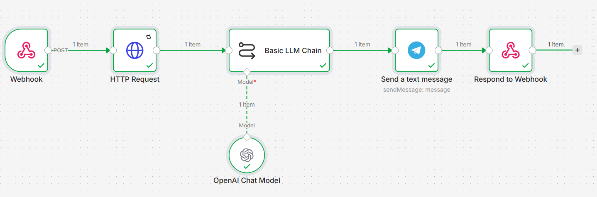

# Web Content Extraction + Telegram Push

> Built on n8n: send a URL → auto-extract core content → AI summarize → push to Telegram

English | [简体中文](README.md)

## Overview

Send a URL to the Webhook, and the workflow does the rest:

```
Webhook receives URL → Jina AI extracts content → LLM summarizes → Telegram push → respond "success"
```

Use cases:
- Quick summary of a long article
- Monitor a page for updates on a schedule
- Track competitor activity
- Personal info stream aggregation

## Features

| Feature | Description |
|---------|-------------|
| **Auto-retry on failure** | HTTP Request node has retry enabled, 5s interval |
| **TG HTML formatting** | Emoji, bold, code blocks — native Telegram rendering |
| **Supports major LLMs** | OpenAI / Qwen / DeepSeek / Gemini etc. |
| **Formatting safety** | Prompt constrains HTML output, prevents unclosed tags |
| **Webhook-triggered** | POST call, easy to integrate |

## Quick Start

### Prerequisites

| Tool/Service | Purpose |
|--------------|---------|
| [n8n](https://n8n.io/) | Workflow platform |
| Telegram Bot | Message delivery |
| LLM API Key | Content summarization |
| Jina AI API Key | Web extraction (optional) |

### Setup

#### 1. Import the workflow

```
n8n → top-right menu → Import from file → select flow.json
```

After import you'll see 6 nodes:

```
Webhook ──→ HTTP Request ──→ Basic LLM Chain ──→ Send a text message ──→ Respond to Webhook
                                      ↑
                              OpenAI Chat Model
```

#### 2. Configure Telegram

**Get Bot Token:**

1. Search [@BotFather](https://t.me/BotFather) on Telegram
2. Send `/newbot`, follow the prompts to name your bot (Username must end with `bot`)
3. You'll receive a Bot Token (e.g. `7890123456:AAFi...`)
4. Click the link to open your new bot's chat, then click **`/start`** to activate it

**Get Chat ID:**

Bots can't message strangers — they need to know who to send to:

- **For personal messages**: Search [@userinfobot](https://t.me/userinfobot), send any message, it returns your personal ID
- **For channels/groups**:
  1. Add the bot to the channel/group and **promote it to administrator**
  2. Forward a message from the channel to [@userinfobot](https://t.me/userinfobot), it returns the channel's Chat ID

**Fill in n8n:**

1. Open the `Send a text message` node
2. `Credential` → `Set up credential` → enter Access Token → Save (top right) → close Telegram account dialog
3. Enter your Chat ID in the `Chat ID` field

#### 3. Configure LLM

1. Open the `OpenAI Chat Model` node
2. `Credential` → `Set up credential` → enter API Key and Base URL → Save (top right) → close OpenAI account dialog
3. Select a model from the `Model` dropdown (e.g. `gpt-4o`, `gpt-4o-mini`)

#### 4. Test

1. Click **Execute workflow** at the bottom to activate
2. Click the `Webhook` node, copy the Webhook URL
3. Send a test request:

```bash
curl -X POST http://localhost:5678/webhook/tg-summary \
  -H "Content-Type: application/json" \
  -d '{"url": "https://jina.ai/blog/reader-lm"}'
```

4. Check if Telegram received the message

## Parameters

### Webhook

- **Method**: `POST`
- **Path**: `/webhook/tg-summary`
- **Content-Type**: `application/json`

**Body:**

| Parameter | Type | Required | Description | Example |
|-----------|------|----------|-------------|---------|
| `url` | string | yes | Web page URL | `"https://example.com/article"` |

```json
{ "url": "https://example.com/tech-article" }
```

Successful response: `"success"`

### Prompt

The built-in prompt in the `Basic LLM Chain` node:

```text
You are a seasoned tech/social media blogger. Read the following web content
and extract 3 of the most core and compelling points.

Formatting:
- Layout suitable for Telegram
- Each point starts with an Emoji
- Tone: witty, concise

Constraints:
1. Use standard HTML format, no Markdown
2. Only use <b>, <i>, <code> tags
3. All tags must be properly closed
4. Escape < > as &lt; &gt;
5. Keep under 4000 characters
- Add a brief CTA at the end
```

> Customize as needed: number of points, language, CTA, etc.

## Advanced

### Output Style

Modify the role prompt in `Basic LLM Chain`:

| Style | Prompt change |
|-------|--------------|
| News | "You are a news editor, summarize objectively and concisely" |
| Social | "You are a witty blogger, keep it sharp and fun" |
| Academic | "You are a rigorous researcher, structured output with citations" |

## Preview



## Links

- [n8n Docs](https://docs.n8n.io/)
- [Telegram Bot API](https://core.telegram.org/bots/api)
- [Jina AI Reader](https://jina.ai/reader)
- [OpenAI API](https://platform.openai.com/docs)