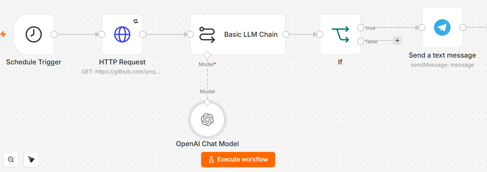

# GitHub Release 更新监控 + Telegram 推送

> 基于 n8n：定时检测 GitHub 仓库更新 → AI 提炼 Release 日志 → 推送到 Telegram

[English](README.en.md) | 简体中文

## 简介

定时检测某个 GitHub 仓库的 Release 更新，有新版本发布时自动推送：

```
定时触发 → 请求 Release 接口 → LLM 提炼更新内容 → 判断是否有更新 → 推送到 Telegram
```

适合这些场景：
- 监控开源项目的新版本发布
- 跟踪依赖库的更新动态
- 技术栈版本变更通知

## 特性

| 特性 | 说明 |
|------|------|
| **定时自动检测** | 默认每分钟检测一次，可自定义间隔 |
| **智能去重** | 无更新时不推送，避免刷屏 |
| **更新内容提炼** | 自动提取版本号、新功能、Bug 修复等关键信息 |
| **支持主流大语言模型** | OpenAI / 通义千问 / DeepSeek / Gemini 等 |
| **TG HTML 排版** | Emoji、加粗、代码块，Telegram 原生渲染 |

## 快速开始

### 前置要求

| 工具/服务 | 用途 |
|-----------|------|
| [n8n](https://n8n.io/) | 工作流平台 |
| Telegram Bot | 消息推送 |
| 大模型 API Key | 内容提炼 |
| GitHub 仓库 | 监控目标 |

### 部署步骤

#### 1. 导入工作流

```
n8n → 右上角菜单 → Import from file → 选择 flow.json
```

导入后会看到 6 个节点：

```
Schedule Trigger ──→ HTTP Request ──→ Basic LLM Chain ──→ If ──→ Send a text message
                                              ↑
                                      OpenAI Chat Model
```

#### 2. 配置监控目标

默认监控 `https://github.com/ynqwer/ai-workflow-hub`，修改方法：

1. 点开 `HTTP Request` 节点
2. 修改 `URL` 为你要监控的 GitHub Release API：
   ```
   https://api.github.com/repos/{owner}/{repo}/releases/latest
   ```
   例如：`https://api.github.com/repos/openai/openai-node/releases/latest`

#### 3. 配置 Telegram

**获取 Bot Token：**

1. Telegram 搜索 [@BotFather](https://t.me/BotFather)
2. 发送 `/newbot`，按提示起名（Username 必须以 `bot` 结尾）
3. 创建成功后会收到一串 Bot Token（如 `7890123456:AAFi...`）
4. 点击链接进入刚创建的机器人聊天框，点一次 **`/start`** 激活它

**获取 Chat ID：**

机器人不能主动给陌生人发消息，需要知道发给谁：

- **发给个人**：搜索 [@userinfobot](https://t.me/userinfobot)，发任意消息，它会返回你的个人 ID
- **发到频道/群组**：
  1. 把机器人拉进频道/群组，**提升为管理员**
  2. 转发频道的一条消息给 [@userinfobot](https://t.me/userinfobot)，它会返回该频道的 Chat ID

**在 n8n 中填入：**

1. 点开 `Send a text message` 节点
2. `Credential` → `Set up credential` → 填入 Access Token → 右上角 Save → 关闭 Telegram account 界面
3. `Chat ID` 填你的 Chat ID

#### 4. 配置大模型

1. 点开 `OpenAI Chat Model` 节点
2. `Credential` → `Set up credential` → 填 API Key 和 Base URL → 右上角 Save → 关闭 OpenAI account 界面
3. 在 `Model` 下拉框选模型（如 `gpt-4o`、`gpt-4o-mini`）

#### 5. 配置检测间隔

默认每分钟检测一次，修改方法：

1. 点开 `Schedule Trigger` 节点
2. 在 `Minutes Interval` 修改间隔时间

#### 6. 测试

1. 点击下方 **Execute workflow** 激活工作流
2. 等待定时触发，或点击 `Execute workflow` 手动触发一次
3. 看 Telegram 有没有收到消息

## 参数说明

### 监控目标

- **默认**：`https://github.com/ynqwer/ai-workflow-hub`
- **修改**：在 `HTTP Request` 节点更改 URL

### 检测间隔

- **默认**：1 分钟
- **修改**：在 `Schedule Trigger` 节点更改 `Minutes Interval`

### Prompt

`Basic LLM Chain` 节点中的内置 Prompt：

```text
你是一个资深的技术播报员与开源社区情报分析师。请阅读以下抓取到的 GitHub 仓库最新 Release JSON 数据。

### 任务要求：
1. 提取出最新的版本号（对应数据中的 tag_name）以及具体的发布日志（对应数据中的 body）。
2. 将原本冗长、通常为英文且包含大量琐碎 Commit 的 Changelog 提炼为 3-5 条纯中文的硬核更新干货。
3. 重点突出：新功能（Features）、修复的重大 Bug（Bug Fixes）、以及是否有破坏性变更（Breaking Changes）。

### 🚨 绝对去重防御机制（核心）：
仔细检查获取的数据。如果经过对比分析，你发现该版本没有任何有效的新增功能、重大修复或业务更新，或者日志正文（body）为空，请【严格仅输出】以下四个字，严禁附带任何标点符号或额外解释：

无更新

### 格式约束（仅在有更新时生效）：
1. 必须使用标准 HTML 格式排版，绝对严禁输出任何 Markdown 标记（不用 **, _, *, `, ### 等）。
2. 只允许使用 <b>、<i>、<code> 三种标签进行样式美化。
3. 所有打开的 HTML 标签必须在句子结束前完全闭合，绝对不能出现孤立标签。
4. 文本中包含的 < 或 > 字符必须转义为 &lt; 和 &gt;。
5. 总长度严格限制在 500 字以内，采用 Emoji 开头进行分段，语言干练，直击要点。
```

> 可以根据需要修改：提炼条数、语言风格、重点内容等

## 高级配置

### 监控其他网页

默认监控 GitHub Release API，也可以改成其他网页：

1. 修改 `HTTP Request` 节点的 URL
2. 修改 `Basic LLM Chain` 的 Prompt，适配新的数据格式

### 历史版本对比

当前工作流只检测最新版本。如需对比历史版本：

1. 添加数据库节点（如 Redis / PostgreSQL）
2. 存储上次的版本号
3. 在 `If` 节点增加版本对比逻辑

## 预览



## 相关链接

- [n8n 文档](https://docs.n8n.io/)
- [Telegram Bot API](https://core.telegram.org/bots/api)
- [GitHub Releases API](https://docs.github.com/en/rest/releases/releases)
- [OpenAI API](https://platform.openai.com/docs)